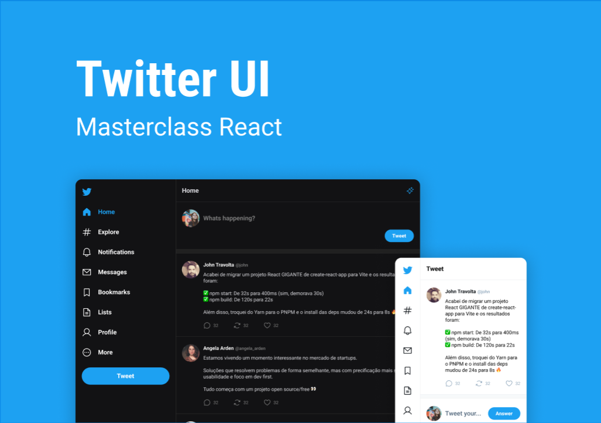

<h1 align="center">Twitter UI</h1>

## Tabela de conteúdos

- [Sobre](#about)
- [Tecnologias](#built_using)
- [Iniciando o projeto](#getting_started)
- [Usabilidade](#usage)


## Sobre <a name = "about"></a>

Projeto com o obejtivo de recriar a interface de usuário antiga do Twitter.



## ⛏️ Tecnologias usadas <a name = "built_using"></a>

- [Typescript](https://www.typescriptlang.org)
- [React](https://react.dev)
- [Vite](https://vitejs.dev)

### Layout
O layout do projeto está disponível por meio do [Figma](https://www.figma.com/community/file/1202694130789327431)

## Iniciando o projeto <a name = "getting_started"></a>

Essas intruções serão responsáveis por te guiar sobre como ter uma cópia funcional do projeto em sua máquina local

### Prerequisitos

Inicialmente você vai precisar de alguns programas instalados para que consiga fazer uso:

- [Visual Studio Code](https://code.visualstudio.com) - Editor de código
- [Node.js + npm](https://nodejs.org/en) - Versão LTS recomendada

### Instalação

Um passo a passo de como realizar a instalação dos arquivos na sua máquina.

Primeiramente, faça o download ou uma cópia dos arquivos para seu computador.

Abra os arquivos com o VSCODE e abra o terminal do editor através do comando CTRL + ' ou por meio da barra de ferramentas.

Em seguida, no terminal, execute a seguinte linha de comando:

```
npm install
```
Esse comando irá instalar todas as dependências necessárias para que consiga realizar os testes.

Em seguida, execute a seguinte linha de comando a seguir para iniciar o servidor local: 

```
npm run dev
```
Com isso, o servidor local será iniciado por meio do Vite. 

Após isso, abra o seu navegador e digite a seguinte URL:

```
http://localhost:5173/
```
Com isso você já deverá conseguir visualizar o projeto.

